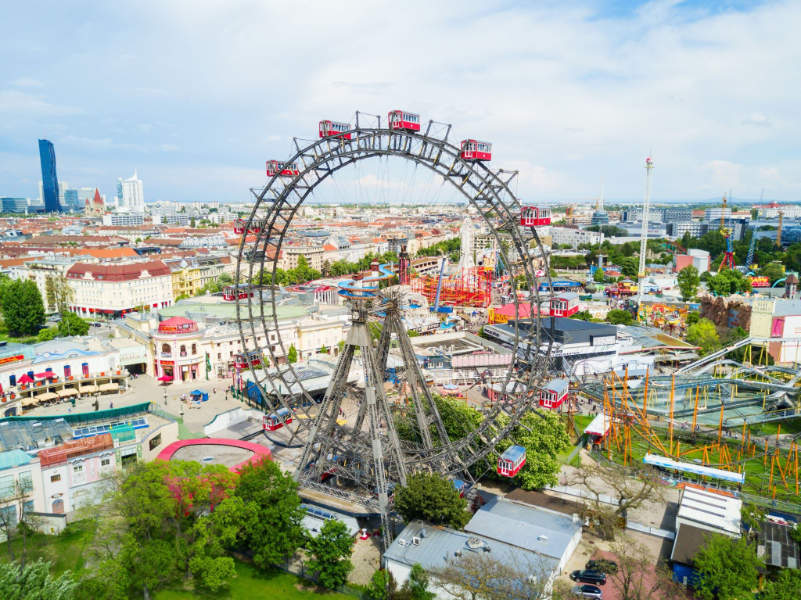

# Awesome ICLR 2024

This repository lists papers and their respective resources presented in ICLR 2024. The repository is currently under construction.

## Application / Robotics 

**Leveraging Hyperbolic Embeddings for Coarse-to-Fine Robot Design**
- https://iclr.cc/media/PosterPDFs/ICLR%202024/17749.png?t=1715255608.6365862
- https://openreview.net/forum?id=q9jQPA6zPK

**Thin-Shell Object Manipulations With Differentiable Physics Simulation**
- https://iclr.cc/media/PosterPDFs/ICLR%202024/18881.png?t=1715042187.221591
- https://openreview.net/forum?id=KsUh8MMFKQ
- https://vis-www.cs.umass.edu/ThinShellLab/
- https://github.com/Genesis-Embodied-AI/ThinShellLab

**Learning with a Mole: Transferable latent spatial representations for navigation without reconstruction**
- https://iclr.cc/media/iclr-2024/Slides/19332.pdf
- https://openreview.net/forum?id=8HCARN2hhw
- https://iclr.cc/media/PosterPDFs/ICLR%202024/19332.png?t=1712824759.0949337

**An Extensible Framework for Open Heterogeneous Collaborative Perception**
- https://iclr.cc/media/PosterPDFs/ICLR%202024/18889.png?t=1714305659.1982362
- https://openreview.net/forum?id=KkrDUGIASk
- https://github.com/yifanlu0227/HEAL

**GenSim: Generating Robotic Simulation Tasks via Large Language Models**
- https://iclr.cc/media/iclr-2024/Slides/18747.pdf
- https://iclr.cc/media/PosterPDFs/ICLR%202024/18747.png?t=1709348691.0918534
- https://github.com/liruiw/GenSim

**DiLu🐴: A Knowledge-Driven Approach to Autonomous Driving with Large Language Models**
- https://arxiv.org/abs/2309.16292
- https://pjlab-adg.github.io/DiLu/

**Tree-Planner: Efficient Close-loop Task Planning with Large Language Models**
- https://iclr.cc/media/PosterPDFs/ICLR%202024/19017.png?t=1714557148.2971904
- https://tree-planner.github.io/

**Neural Contractive Dynamical Systems**
- https://www2.compute.dtu.dk/~sohau/papers/ncds2024/ICLR2024_NCDS.pdf

**Towards Diverse Behaviors: A Benchmark for Imitation Learning with Human Demonstrations**
- https://arxiv.org/abs/2402.14606
- https://iclr.cc/media/PosterPDFs/ICLR%202024/19381.png
- https://alrhub.github.io/d3il-website/

## Self-Supervised Learning

**Contrastive Learning is Spectral Clustering on Similarity Graph**
- https://openreview.net/forum?id=hLZQTFGToA
- https://github.com/yifanzhang-pro/Kernel-InfoNCE

**InfoCon: Concept Discovery with Generative and Discriminative Informativeness**
- https://openreview.net/forum?id=g6eCbercEc
- https://iclr.cc/media/PosterPDFs/ICLR%202024/18159.png

**Self-Guided Masked Autoencoders for Domain-Agnostic Self-Supervised Learning**
- https://openreview.net/forum?id=HiYMiZYwkw

**Masked Autoencoders with Multi-Window Local-Global Attention Are Better Audio Learners**

**Point2SSM: Learning Morphological Variations of Anatomies from Point Clouds**
- https://openreview.net/forum?id=DqziS8DG4M

**Towards domain-invariant Self-Supervised Learning with Batch Styles Standardization**
- https://openreview.net/forum?id=qtE9K23ISq
- https://gitlab.com/vitadx/articles/towards-domain-invariant-ssl-through-bss
- https://iclr.cc/media/PosterPDFs/ICLR%202024/17712.png

**Pre-training LiDAR-based 3D Object Detectors through Colorization**
- https://openreview.net/forum?id=fB1iiH9xo7
- https://github.com/tydpan/GPC/

**A Mutual Information Perspective on Federated Contrastive Learning**
- https://iclr.cc/media/iclr-2024/Slides/18925.pdf
- https://iclr.cc/media/PosterPDFs/ICLR%202024/18925.png?t=1714148686.430328
- https://openreview.net/forum?id=JrmPG9ufKg

**Understanding Augmentation-based Self-Supervised Representation Learning via RKHS Approximation and Regression**
- https://openreview.net/forum?id=Ax2yRhCQr1
- https://iclr.cc/media/PosterPDFs/ICLR%202024/19234.png?t=1713743427.9124763

**Separating common from salient patterns with Contrastive Representation Learning**
- https://iclr.cc/virtual/2024/poster/19533
- https://openreview.net/forum?id=30N3bNAiw3
- https://iclr.cc/media/iclr-2024/Slides/19533.pdf
- https://github.com/neurospin-projects/2024_rlouiset_sep_clr

**Self-Supervised Dataset Distillation for Transfer Learning**
- https://openreview.net/forum?id=h57gkDO2Yg
- https://iclr.cc/virtual/2024/poster/18115
- https://github.com/db-Lee/selfsup_dd

## Deep Learning->Generative Models and Autoencoders

**Manifold Diffusion Fields**
- https://openreview.net/forum?id=BZtEthuXRF
- https://github.com/EmilienDupont/neural-function-distributions

